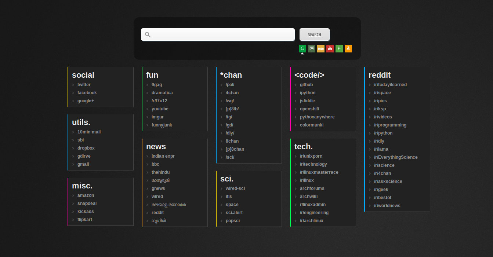

startpage.py
============

"startpage.py" is a python script that generates an html file than can be used as homepage or the newtab page. It features multiple search engines and customisable links that are separated into different categories. (currently only upto 10 categories are supported)



Customization
-------------

Edit the file __data/links.json__ to add links.


Run the script to generate the *index.html* file
```
python startpage.py
```

credits
--------
This work is based on the following works. Thanks to all the original creator.

* [startpage](http://www.deviantart.com/art/KMay-Start-Page-184915031) by *DeFined04*
* google powered search by [tutorialzine](http://tutorialzine.com/2010/09/google-powered-site-search-ajax-jquery/)
* [icon set](http://dakirby309.deviantart.com/art/Metro-UI-Icon-Set-725-Icons-280724102) by *dAKirby309*
